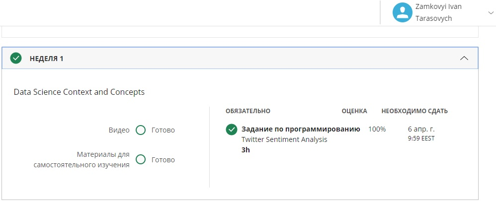
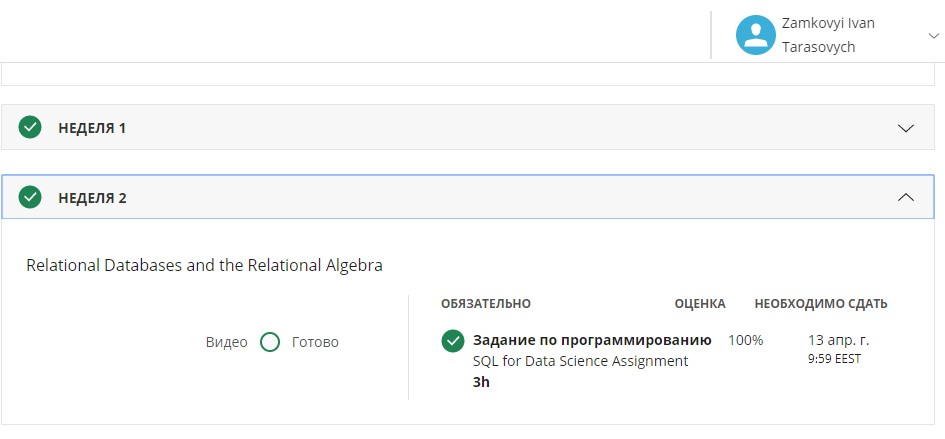
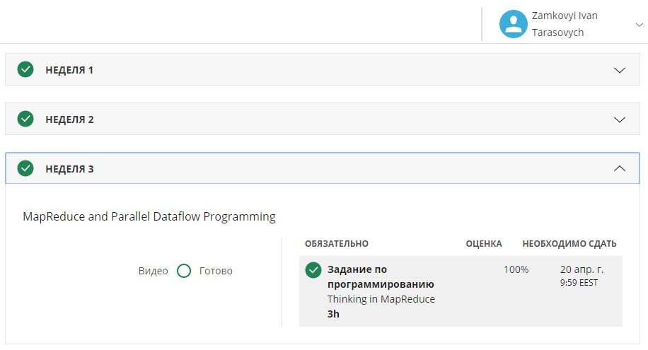
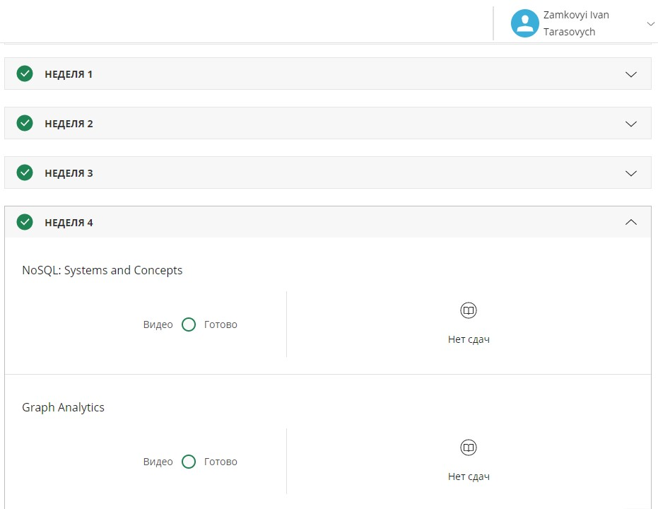

# Data-Manipulation-at-Scale-Course
Data Manipulation at Scale: Systems and Algorithms

Done by Ivan Zamkovyi, group KP-73: [Certificate](Certificate.pdf)

Results:   
week 1: 
week 2: 
week 3: 
week 4: 
